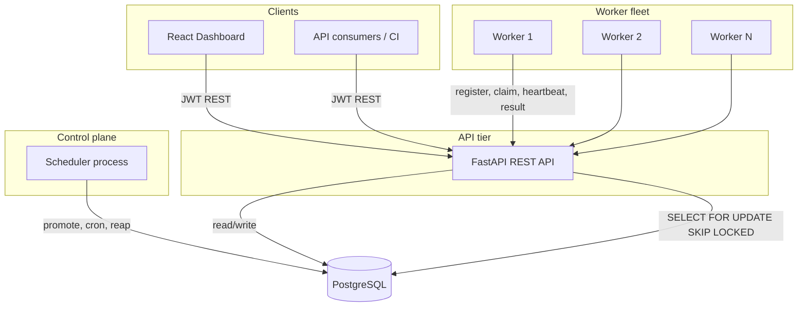
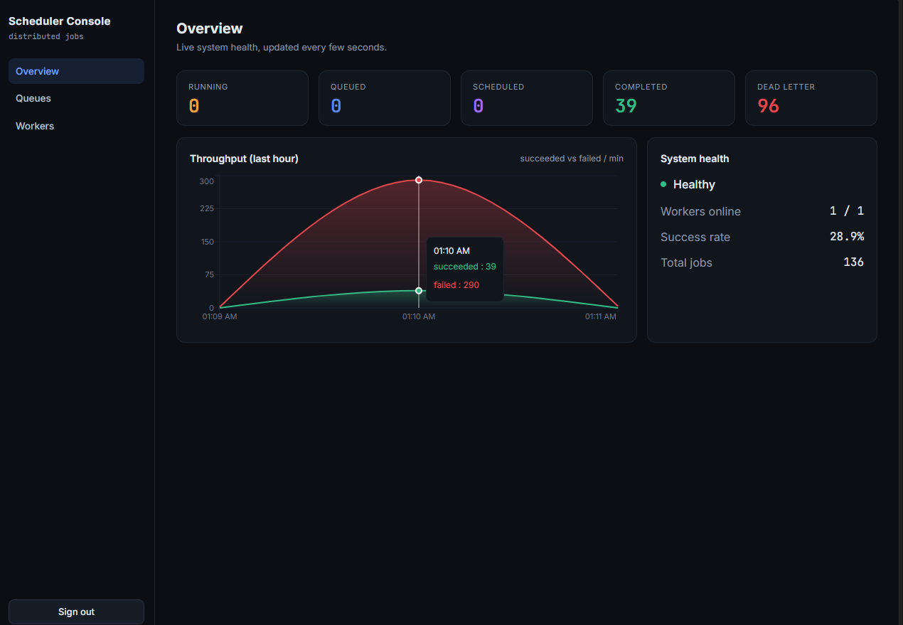
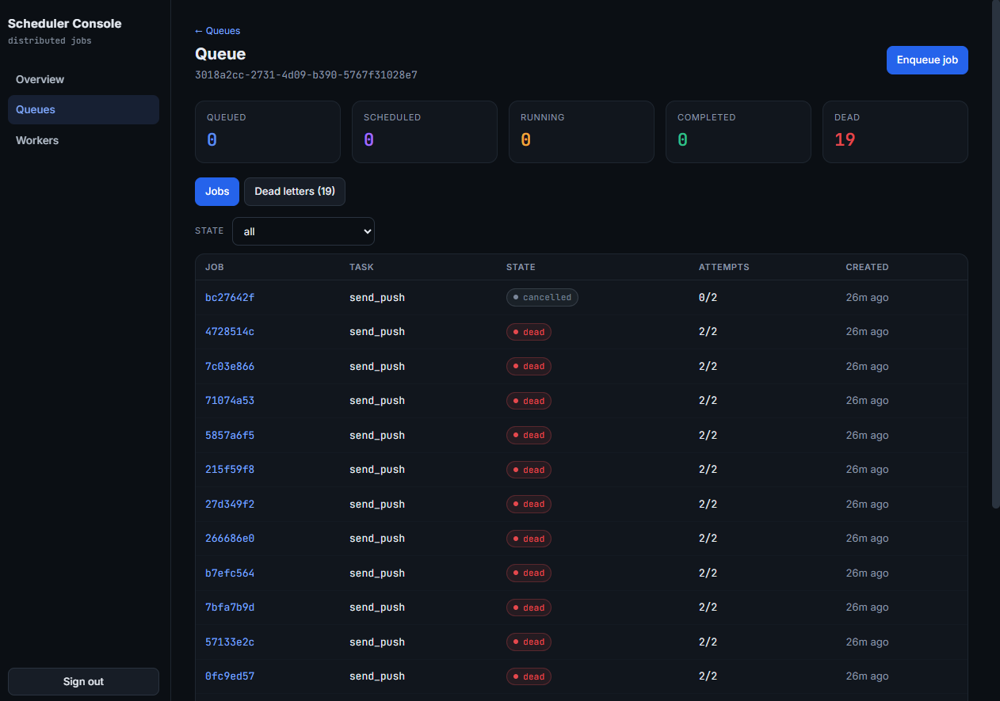
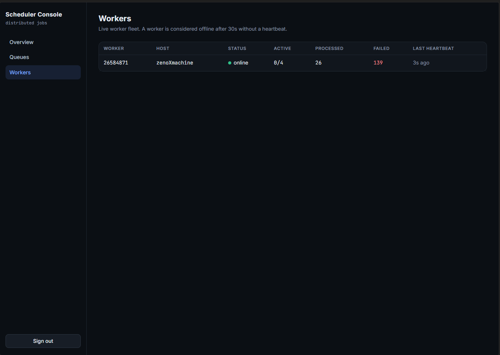

# RUN in ONE Click 

Run the file : run-local.bat


  Dashboard : http://localhost:5173
  API docs  : http://localhost:8000/docs


The demo login is: ( for better showcase)

( you can create new as well)

Email: demo@example.com
Password: password123

### Step 1 — Clone the repo

```bash
git clone https://github.com/Prithwix00/Distributed-Job-Scheduler-Platform-Production-Ready-Background-Task-Processing-System.git
```

### Step 2 — Go into the project folder

```bash
cd Distributed-Job-Scheduler-Platform-Production-Ready-Background-Task-Processing-System/scheduler
```

### Step 3 — Run it (Windows)

Double-click `run-local.bat`

Or from terminal:

```bash
run-local.bat
```

That's it. It installs everything automatically on first run and opens all four services.

---

## What opens

| Service | URL |
|---|---|
| Dashboard | http://localhost:5173 |
| API docs (Swagger) | http://localhost:8000/docs |

---

## Demo login
Email:    demo@example.com
Password: password123


# Distributed Job Scheduler

A production-inspired platform for reliably running asynchronous background jobs
across many workers. It provides authentication and multi-tenant project
management, configurable job queues, five job types (immediate, delayed,
scheduled, recurring cron, batch), a worker fleet that claims work atomically,
a full retry pipeline with a Dead Letter Queue, plus a live operations
dashboard.

The design goal was engineering quality over feature count: correct
concurrency, a clean relational schema, observable execution and a modular
codebase that is easy to reason about.

---

## Table of contents

- [System overview](#system-overview)
- [Screenshots](#screenshots)
- [Quick start (local, no Docker)](#quick-start-local-no-docker)
- [Quick start (Docker)](#quick-start-docker)
- [Project layout](#project-layout)
- [Core concepts](#core-concepts)
- [API summary](#api-summary)
- [Testing](#testing)
- [Documentation](#documentation)

---

## System overview

The platform is composed of five services around a single PostgreSQL database.
Postgres is deliberately both the system of record and the queue substrate: its
row-level locking (`FOR UPDATE SKIP LOCKED`) is what makes distributed claiming
correct without a separate broker.



Workers talk to the database through the API rather than connecting directly.
This keeps a single authorization and validation boundary, lets workers run
anywhere that can reach the API over HTTP and keeps the worker process thin.

- **API** (FastAPI) serves the REST interface for users and workers.
- **Scheduler** is a single process that owns all time-based transitions:
  promoting due jobs, firing cron schedules, reaping dead workers.
- **Workers** are a horizontally scalable fleet. Each polls the API, claims
  jobs atomically, runs them concurrently, heartbeats and shuts down gracefully.
- **Frontend** (React) is the operations console.
- **PostgreSQL** stores everything and provides the row-level locking that makes
  claiming safe.

The full component responsibilities, control flow and reliability model live in
[docs/ARCHITECTURE.md](docs/ARCHITECTURE.md).

---

## Screenshots

| Overview | Queue detail | Workers |
| --- | --- | --- |
|  |  |  |

---

## Quick start (local, no Docker)

Runs against SQLite so no database server is needed. Python 3.11+ and Node.js
must be installed.

### Windows: one command

From the `scheduler` folder, double-click `run-local.bat` (or run it from a
terminal). It does first-run setup automatically, then opens the API, scheduler,
worker and dashboard in separate windows. The worker waits for the API on its
own, so start order does not matter. Close the windows to stop.

```
.\run-local.bat
```

A PowerShell version is also provided:

```
powershell -ExecutionPolicy Bypass -File .\run-local.ps1
```

Then open http://localhost:5173.

### Manual (any OS): four terminals

```bash
# 1. install
cd backend && python -m venv .venv && . .venv/bin/activate
pip install -r requirements.txt

# 2. API   (terminal 1)
DATABASE_URL=sqlite:///./dev.db uvicorn app.main:app --reload

# 3. Scheduler  (terminal 2)
DATABASE_URL=sqlite:///./dev.db python -m app.runtime.scheduler

# 4. Worker  (terminal 3)
DATABASE_URL=sqlite:///./dev.db python -m app.runtime.worker --base-url http://localhost:8000

# 5. Frontend  (terminal 4)
cd frontend && npm install && npm run dev
```

The `Makefile` wraps these as `make backend-dev`, `make scheduler-dev`,
`make worker-dev` and `make frontend-dev`. Run `make help` for the full list.

The same code runs on SQLite for local development and PostgreSQL in production.
The atomic claim uses `FOR UPDATE SKIP LOCKED` on Postgres with a correct
guarded-update fallback on SQLite, so behaviour is identical in both.

---

## Quick start (Docker)

The fastest path. Requires Docker with Compose v2.

```bash
cp .env.example .env          # optional: set a real JWT_SECRET
docker compose up --build
```

This starts Postgres, runs database migrations, then brings up the API, the
scheduler, two workers and the dashboard. When it is running:

- Dashboard: http://localhost:5173
- API docs (OpenAPI/Swagger): http://localhost:8000/docs

Seed a demo workspace with a mix of job types:

```bash
make seed        # or: cd backend && python -m app.runtime.seed
```

Then sign in at the dashboard with `demo@example.com` / `password123`.

Two worker replicas run by default so you can watch distributed, contention-free
claiming on the Workers page. Scale them live:

```bash
docker compose up --scale worker=5
```

---

## Project layout

```
scheduler/
  backend/
    app/
      config.py          settings (env-driven)
      database.py        engine + session, dialect-aware
      security.py        JWT + password hashing
      core.py            structured logging + typed errors
      deps.py            auth, pagination, tenancy scoping
      main.py            FastAPI app, middleware, error handlers
      models/            SQLAlchemy models (the 12 tables)
      schemas/           Pydantic request/response models
      services/          business logic
        retry.py         backoff computation (pure functions)
        claiming.py      atomic claim + lease reaping
        job_service.py   lifecycle transitions, DLQ handoff
        scheduling.py    promotion, cron firing, worker reaping
      routers/           HTTP endpoints per resource
      runtime/
        executor.py      task registry + demo handlers
        worker.py        the worker process
        scheduler.py     the scheduler process
        seed.py          demo data
    migrations/          Alembic migrations
    tests/               pytest suite (31 tests)
  frontend/              React + Vite + TypeScript dashboard
  docs/                  architecture, ER diagram, API, design decisions
  docker-compose.yml
  Makefile
```

---

## Core concepts

**Job lifecycle.** A job moves through
`QUEUED -> CLAIMED -> RUNNING -> COMPLETED`. On failure it becomes `SCHEDULED`
for a retry after a backoff delay, or `DEAD` once retries are exhausted (which
also writes a Dead Letter Queue entry). Delayed, scheduled and dependent jobs
start in `SCHEDULED` and the scheduler promotes them to `QUEUED` when due.

**Atomic claiming.** The core correctness property is that each job runs on
exactly one worker. Claiming locks candidate rows with `FOR UPDATE SKIP LOCKED`
so concurrent workers take disjoint sets and never collide. See
[docs/DESIGN_DECISIONS.md](docs/DESIGN_DECISIONS.md).

**Leases and recovery.** A claimed job carries a lease that its worker renews on
every heartbeat. If a worker dies, the lease expires and the scheduler requeues
the job so another worker can pick it up. Idempotent handlers make that re-run
safe.

**Retry strategies.** Fixed, linear and exponential backoff, each with optional
jitter to avoid retry storms. The policy is snapshotted onto the job at enqueue
time so later policy edits never rewrite in-flight jobs.

---

## API summary

All endpoints are under `/api/v1`. Full reference in [docs/API.md](docs/API.md).

| Area | Endpoints |
| --- | --- |
| Auth | `POST /auth/register`, `POST /auth/login`, `GET /auth/me` |
| Projects | `GET/POST /projects`, `GET /projects/{id}` |
| Queues | `POST /projects/{id}/queues`, `GET /queues/{id}`, `PATCH /queues/{id}`, pause/resume, `GET /queues/{id}/stats` |
| Jobs | `POST /queues/{id}/jobs`, `POST /queues/{id}/batches`, `GET /queues/{id}/jobs` (filter + paginate), `GET /jobs/{id}`, cancel, retry |
| Schedules | `POST/GET /queues/{id}/schedules`, toggle |
| Dead letters | `GET /queues/{id}/dead-letters`, `POST /dead-letters/{id}/replay` |
| Workers | register, heartbeat, claim, start, result, `GET /workers` |
| Dashboard | `GET /dashboard/overview`, `GET /dashboard/throughput` |

Interactive OpenAPI docs are served at `/docs`.

---

## Testing

```bash
cd backend && python -m pytest
```

The suite covers the parts most likely to break: retry backoff maths, atomic
claiming (including a threaded no-double-claim test with eight concurrent
workers), lease reaping, the full lifecycle through completion, retry and Dead
Letter Queue, cron firing, dependency release plus the REST surface end to end
through a `TestClient`. See [docs/DESIGN_DECISIONS.md](docs/DESIGN_DECISIONS.md#testing-strategy)
for what is tested and why.

---

## Documentation

- [docs/ARCHITECTURE.md](docs/ARCHITECTURE.md): components, control flow, reliability model, scaling.
- [docs/ER_DIAGRAM.md](docs/ER_DIAGRAM.md): entity relationship diagram, keys, indexes, normalization, cascades.
- [docs/API.md](docs/API.md): full REST reference with request and response shapes.
- [docs/DESIGN_DECISIONS.md](docs/DESIGN_DECISIONS.md): major trade-offs and the reasoning behind them.
