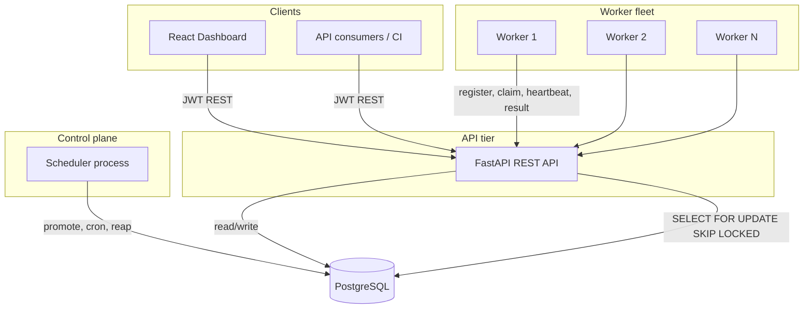
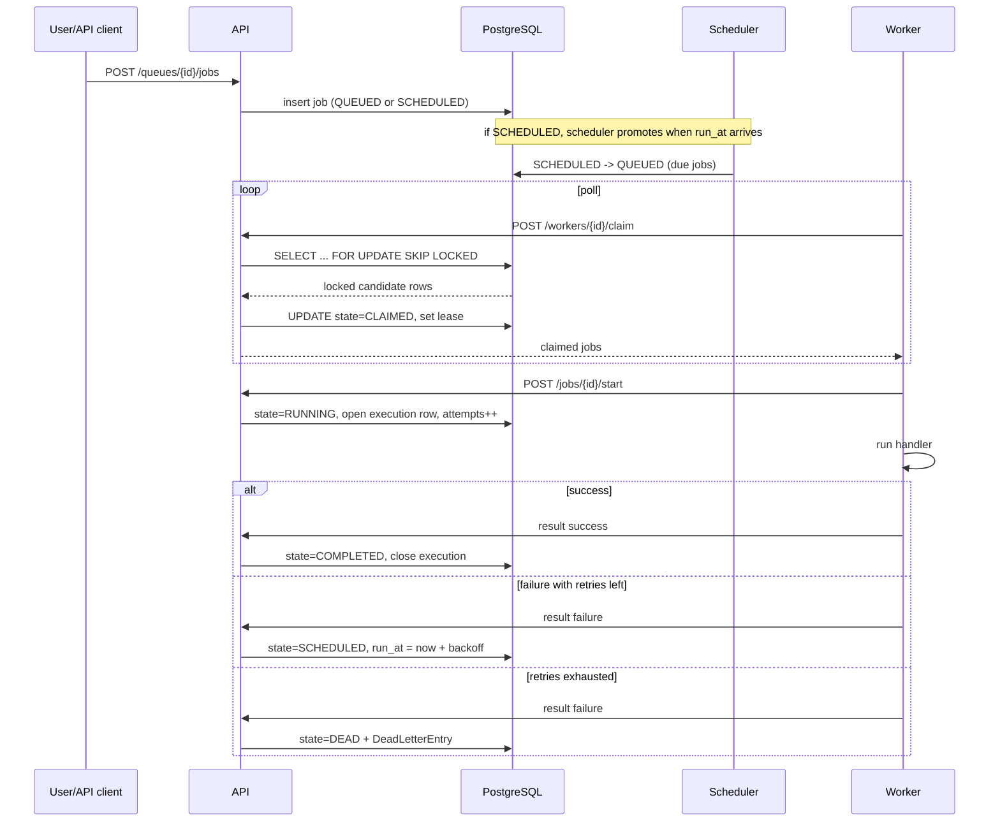

# Architecture

## System overview

The platform is composed of five services around a single PostgreSQL database.
Postgres is deliberately both the system of record and the queue substrate: its
row-level locking (`FOR UPDATE SKIP LOCKED`) is what makes distributed claiming
correct without a separate broker.

Workers talk to the database through the API rather than connecting directly.
This keeps a single authorization and validation boundary, lets workers run
anywhere that can reach the API over HTTP and keeps the worker process thin.

## Component responsibilities

**API (FastAPI).** Stateless HTTP layer. Handles auth, tenant scoping,
validation, pagination and the worker-facing claim/heartbeat/result endpoints.
Every state change routes through the service layer so invariants live in one
place. It scales horizontally behind a load balancer because it holds no local
state.

**Scheduler.** A single-instance loop that owns time. On each tick it promotes
`SCHEDULED` jobs whose `run_at` has arrived into `QUEUED`, materialises a job for
every cron schedule that is due, marks workers whose heartbeat expired as dead
and requeues jobs whose leases lapsed. Running exactly one scheduler avoids two
clocks disagreeing. If it stops, nothing is lost or duplicated; promotion simply
pauses until it restarts.

**Worker fleet.** Horizontally scalable. Each worker registers, then loops:
claim a batch of jobs (bounded by free capacity), dispatch each to a thread
pool, report results. A background thread heartbeats every few seconds, which
also renews the lease on every job the worker still owns. On `SIGTERM`/`SIGINT`
it stops claiming and drains in-flight work before exiting.

**Frontend.** React operations console. Polls the API for overview metrics,
queue stats, the job explorer, worker liveness and a throughput chart. Polling
was chosen over WebSockets for operational simplicity; the trade-off is
discussed in the design decisions.

**PostgreSQL.** Single source of truth. Holds identity, configuration, jobs,
execution history, logs, worker state and the Dead Letter Queue.

## Control flow: a job from submit to done

## Reliability model

The system is designed around one hard invariant and one recovery mechanism.

**Exactly-once claiming (the invariant).** A `QUEUED` job is handed to exactly
one worker. Concurrent claimers lock disjoint candidate rows with
`SKIP LOCKED`, so no two workers ever see the same row as claimable. The state
transition itself is a guarded `UPDATE ... WHERE state = 'queued'`, so even
without row locks (SQLite) only one writer can win.

**Lease-based recovery (the safety net).** Exactly-once *delivery* is
impossible in the presence of crashes, so the system targets at-least-once
execution with idempotent handlers. Each claimed job carries a lease that its
owner renews on every heartbeat. A worker that crashes stops renewing; the
scheduler's `reap_expired_leases` returns the job to `QUEUED` for another worker.
Because handlers are written to be idempotent, a re-run after a crash is safe.

**Concurrency limits.** Each queue has a `concurrency_limit`. The claim query
counts jobs already `CLAIMED` or `RUNNING` for the queue and never claims beyond
the remaining capacity, so a queue cannot exceed its configured parallelism even
across many workers.

**Idempotency at submission.** An optional `idempotency_key` is unique per
queue, so a retried submission collapses to the existing job instead of creating
a duplicate.

## Scaling and failure behaviour

| Concern | Behaviour |
| --- | --- |
| More throughput | Add worker replicas. `SKIP LOCKED` means added workers take disjoint rows with no coordination. |
| API load | API is stateless; run multiple instances behind a load balancer. |
| Scheduler failure | Time-based promotion pauses until restart. No data loss or duplication. Jobs already queued still run. |
| Worker crash | Lease expires, scheduler requeues the job, another worker runs it. |
| Database as bottleneck | The claim is a single indexed, short transaction. Vertical scaling and read replicas for dashboards handle large loads; the design notes cover sharding by queue as the next step. |
| Poison job | Retries with backoff, then Dead Letter Queue for human triage and replay. |

## Observability

Every attempt is recorded as a `JobExecution` row with duration and status, so
retry history and metrics are queryable rather than lost in logs. Structured
JSON logs carry a request id through the API. `JobLog` rows capture per-job,
per-attempt events. The dashboard reads aggregate counts and a bucketed
throughput series for at-a-glance health.
