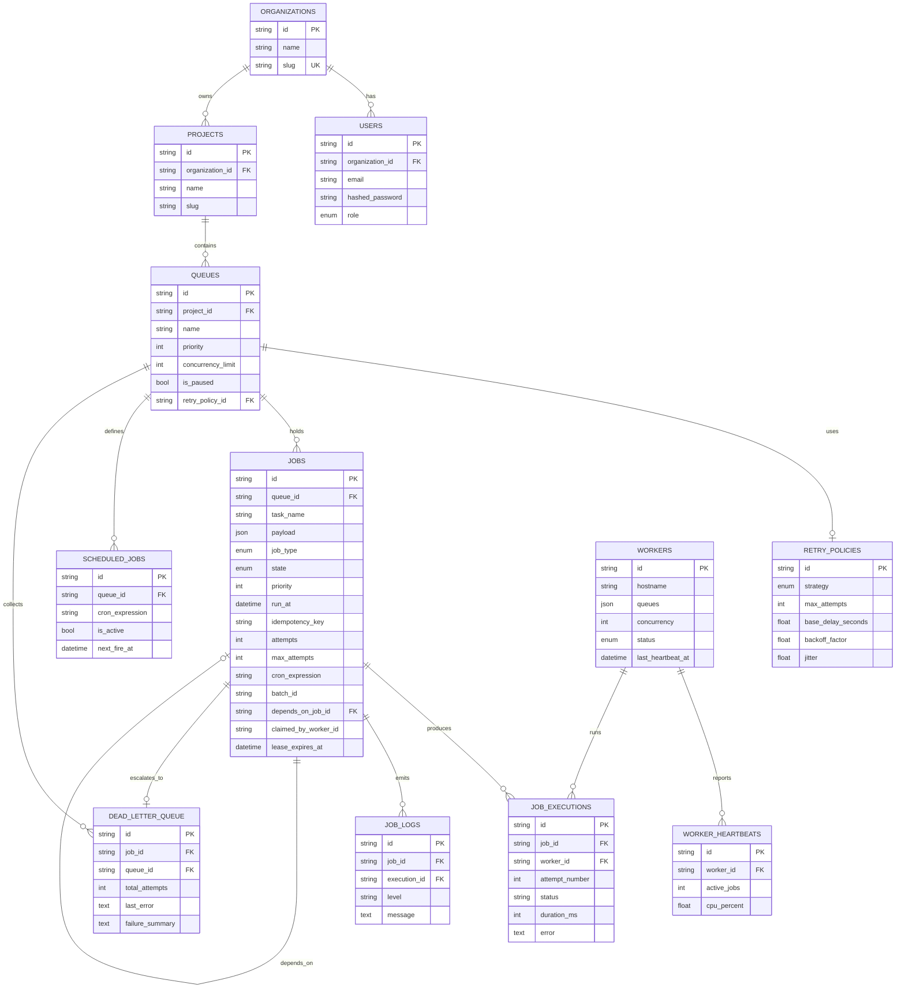

# Database Design

The schema is normalised to third normal form, scoped by tenant and indexed for
the two hot paths: claiming jobs and rendering the dashboard.

## Entity relationship diagram

## Tables and keys

Twelve tables. Every primary key is a UUID string, which keeps ids opaque, non
sequential (no enumeration or capacity leakage) and safe to generate on the
client or across shards without coordination.

| Table | Purpose | Notable foreign keys | On delete |
| --- | --- | --- | --- |
| organizations | Top-level tenant | | |
| users | Members of an org | organization_id | CASCADE |
| projects | A workspace owning queues | organization_id | CASCADE |
| retry_policies | Reusable backoff config | | |
| queues | A job queue with priority, concurrency, retry policy | project_id, retry_policy_id | CASCADE / SET NULL |
| jobs | The central work item | queue_id, depends_on_job_id | CASCADE / SET NULL |
| job_executions | One row per attempt | job_id, worker_id | CASCADE / SET NULL |
| job_logs | Structured per-attempt log lines | job_id, execution_id | CASCADE |
| scheduled_jobs | Cron definitions | queue_id | CASCADE |
| dead_letter_queue | Exhausted jobs for triage | job_id, queue_id | CASCADE |
| workers | Worker registry | | |
| worker_heartbeats | Liveness and load samples | worker_id | CASCADE |

## Cascading behaviour

Deletes follow ownership. Removing an organization removes its users, projects,
queues and all downstream jobs, executions, logs, schedules and dead letters
through `ON DELETE CASCADE`. Two relationships intentionally use `SET NULL`
instead: a queue's `retry_policy_id` (deleting a shared policy should not delete
the queue) and a job's `depends_on_job_id` and an execution's `worker_id`
(history should survive the deletion of a parent job or a retired worker).

## Indexing strategy

The claim path is the hottest query in the system, so it gets a dedicated
composite index:

- `ix_jobs_claim (queue_id, state, priority, run_at)` supports the exact filter
  and ordering the claim uses: find `QUEUED` rows for a queue, highest priority
  and oldest `run_at` first. This keeps claiming logarithmic even when millions
  of terminal-state rows sit in the table.
- `ix_jobs_state_runat (state, run_at)` serves the scheduler's promotion scan
  across all queues.
- `ix_jobs_batch (batch_id)` groups batch siblings.
- `uq_job_idem (queue_id, idempotency_key)` enforces submission idempotency.
- `ix_exec_job (job_id, attempt_number)` renders a job's ordered attempt history.
- `ix_joblog_job_ts (job_id, created_at)` streams a job's logs in order.
- `ix_sched_next_fire (is_active, next_fire_at)` finds due cron schedules.
- `ix_worker_status_seen (status, last_heartbeat_at)` finds stale workers to reap.
- `ix_dlq_queue (queue_id, created_at)` paginates the Dead Letter Queue.

Uniqueness constraints double as indexes: org slug, project slug per org, queue
name per project, user email per org.

## Normalization

The schema is in third normal form. Reusable retry configuration lives in its
own `retry_policies` table rather than being duplicated on every queue. Each
execution attempt is its own row rather than a JSON blob on the job, which keeps
attempt history queryable and metrics aggregatable.

One deliberate denormalization exists on `jobs`: the effective retry parameters
(`max_attempts`, `retry_strategy`, `base_delay_seconds` and so on) are
snapshotted from the queue's policy at enqueue time. This is not redundancy for
its own sake; it guarantees that editing a queue's policy never rewrites the
backoff behaviour of jobs already in flight. It also removes a join from the hot
failure path.

## Performance considerations

- **Short claim transactions.** The claim locks only the rows it will take and
  commits immediately, so lock hold time is minimal and `SKIP LOCKED` lets other
  workers proceed in parallel.
- **JSONB on Postgres.** Payloads, results and log context use `JSONB` on
  Postgres (indexable, operator-rich) and plain `JSON` on SQLite through a
  dialect variant.
- **Bounded growth.** Terminal jobs, executions and heartbeats accumulate. In
  production these are archival candidates; a periodic job can move old
  completed rows to cold storage. The composite claim index ensures active
  claiming stays fast regardless of how much terminal history has built up.
- **Read/write split.** Dashboard aggregates are read-only and can be served
  from a replica so reporting never contends with claiming.

## Migrations

Schema changes are managed with Alembic. The initial migration under
`backend/migrations/versions/` is generated from the model metadata and creates
all twelve tables with their indexes and constraints. The Docker `api` service
runs `alembic upgrade head` before serving, so a fresh deployment provisions the
schema automatically. Local SQLite development can also fall back to
`create_all` on startup for zero-setup iteration.
